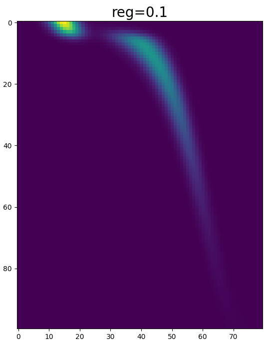
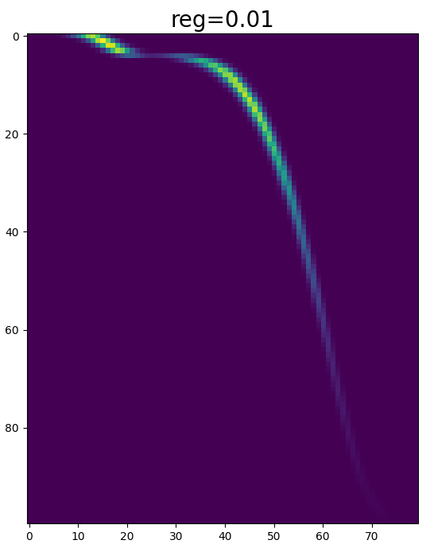

# RegOT-Python

**RegOT** is a collection of state-of-the-art solvers for
regularized optimal transport (OT) problems, implemented in
efficient C++ code. This repository is the Python interface
to **RegOT**.

## 📝 Formulation

**RegOT** mainly solves two types of regularized OT problems:
the entropic-regularized OT (EROT) and the quadratically regularized OT (QROT).

EROT, also known as the Sinkhorn-type OT, considers the following optimization problem:

```math
\begin{align*}
\min_{T\in\mathbb{R}^{n\times m}}\quad & \langle T,M\rangle-\eta h(T),\\
\text{subject to}\quad & T\mathbf{1}_{m}=a,T^{T}\mathbf{1}_{n}=b,T\ge0,
\end{align*}
```

where $a\in\mathbb{R}^n$ and $b\in\mathbb{R}^m$ are two given
probability vectors with $a_i>0$, $b_j>0$, $\sum_{i=1}^n a_i=\sum_{j=1}^m b_j=1$,
and $M\in\mathbb{R}^{n\times m}$ is a given cost matrix.
The function $h(T)=\sum_{i=1}^{n}\sum_{j=1}^{m}T_{ij}(1-\log T_{ij})$ is the entropy term,
and $\eta>0$ is a regularization parameter.

QROT, also known as the Euclidean-regularized OT, is concerned with the problem

```math
\begin{align*}
\min_{T\in\mathbb{R}^{n\times m}}\quad & \langle T,M\rangle+(\gamma/2) \Vert T \Vert_F^2,\\
\text{subject to}\quad & T\mathbf{1}_{m}=a,T^{T}\mathbf{1}_{n}=b,T\ge0.
\end{align*}
```

## 🔧 Solvers

Currently **RegOT** contains the following solvers for EROT:

- `sinkhorn_bcd`: the block coordinate descent (BCD) algorithm, equivalent to the well-known Sinkhorn algorithm.
- `sinkhorn_apdagd`: the adaptive primal-dual accelerate gradient descent (APDAGD) algorithm
([link to paper](https://arxiv.org/pdf/1802.04367)).
- `sinkhorn_lbfgs_dual`: the L-BFGS algorithm applied to the dual problem of EROT.
- `sinkhorn_newton`: Newton's method applied to the dual problem of EROT.
- `sinkhorn_ssns`: the safe and sparse Newton method for Sinkhorn-type OT (SSNS, [this is our paper!](https://openreview.net/pdf?id=Nmmiyjw7Xg)).

The following solvers are available for the QROT problem:

- `qrot_bcd`: the BCD algorithm.
- `qrot_gd`: the line search gradient descent algorithm applied to the dual problem of QROT.
- `qrot_apdagd`: the APDAGD algorithm ([link to paper](https://arxiv.org/pdf/1802.04367)).
- `qrot_pdaam`: the primal-dual accelerated alternating minimization (PDAAM) algorithm ([link to paper](https://arxiv.org/pdf/1906.03622)).
- `qrot_lbfgs_dual`: the L-BFGS algorithm applied to the dual problem of QROT.
- `qrot_lbfgs_semi_dual`: the L-BFGS algorithm applied to the semi-dual problem of QROT ([link to paper](https://arxiv.org/pdf/1710.06276)).
- `qrot_assn`: the adaptive semi-smooth Newton (ASSN) method applied to the dual problem of QROT ([link to paper](https://arxiv.org/pdf/1603.07870)).
- `qrot_grssn`: the globalized and regularized semi-smooth Newton (GRSSN) method applied to the dual problem of QROT ([link to paper](https://arxiv.org/pdf/1903.01112)).

## 💽 Installation

### Using `pip`

You can simply install **RegOT** using the `pip` command:

```bash
pip install regot
```

### Building from source

A C++ compiler is needed to build **RegOT** from source. Enter the source directory and run

```bash
pip install . -r requirements.txt
```

## 📗 Example

The code below shows a minimal example computing EROT
given $a$, $b$, $M$, and $\eta$.


```py
import numpy as np
from scipy.stats import expon, norm
import regot
import matplotlib.pyplot as plt

# OT between two discretized distributions
# One is exponential, the other is mixture normal
def example(n=100, m=80):
    x1 = np.linspace(0.0, 5.0, num=n)
    x2 = np.linspace(0.0, 5.0, num=m)
    distr1 = expon(scale=1.0)
    distr2 = norm(loc=1.0, scale=0.2)
    distr3 = norm(loc=3.0, scale=0.5)
    a = distr1.pdf(x1)
    a = a / np.sum(a)
    b = 0.2 * distr2.pdf(x2) + 0.8 * distr3.pdf(x2)
    b = b / np.sum(b)
    M = np.square(x1.reshape(n, 1) - x2.reshape(1, m))
    return M, a, b

# Source and target distribution vectors `a` and `b`
# Cost matrix `M`
# Regularization parameter `reg`
np.random.seed(123)
M, a, b = example(n=100, m=80)
reg = 0.1

# Algorithm: block coordinate descent (the Sinkhorn algorithm)
res1 = regot.sinkhorn_bcd(
    M, a, b, reg, tol=1e-6, max_iter=1000, verbose=1)

# Algorithm: SSNS
reg = 0.01
res2 = regot.sinkhorn_ssns(
    M, a, b, reg, tol=1e-6, max_iter=1000, verbose=0)
```

We can retrieve the computed transport plans and visualize them:

```py
def vis_plan(T, title=""):
    fig = plt.figure(figsize=(8, 8))
    plt.imshow(T, interpolation="nearest")
    plt.title(title, fontsize=20)
    plt.show()

vis_plan(res1.plan, title="reg=0.1")
vis_plan(res2.plan, title="reg=0.01")
```

 
