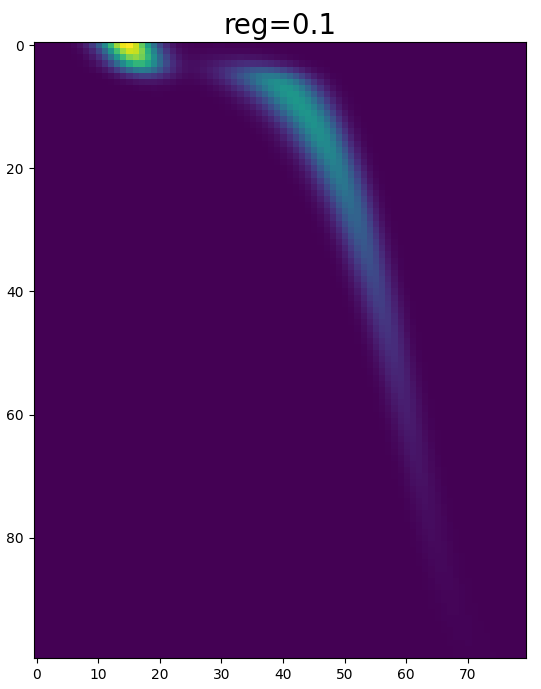
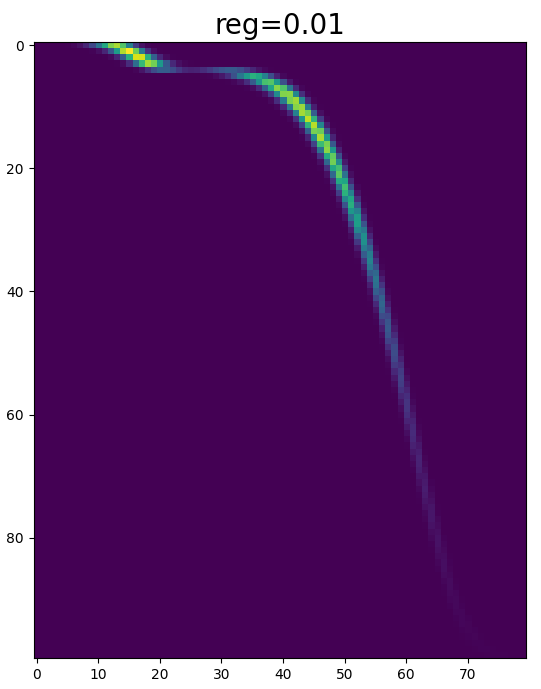

# RegOT-Python

**RegOT** is a collection of state-of-the-art solvers for
regularized optimal transport (OT) problems, implemented in
efficient C++ code. This repository is the Python interface
to **RegOT**.

## 📝 Formulation

**RegOT** mainly solves two types of regularized OT problems:
the entropic-regularized OT (EROT) and the quadratically regularized OT (QROT).

EROT, also known as the Sinkhorn-type OT, considers the following optimization problem:

```math
\begin{align*}
\min_{T\in\mathbb{R}^{n\times m}}\quad & \langle T,M\rangle-\eta h(T),\\
\text{subject to}\quad & T\mathbf{1}_{m}=a,T^{T}\mathbf{1}_{n}=b,T\ge0,
\end{align*}
```

where $a\in\mathbb{R}^n$ and $b\in\mathbb{R}^m$ are two given
probability vectors with $a_i>0$, $b_j>0$, $\sum_{i=1}^n a_i=\sum_{j=1}^m b_j=1$,
and $M\in\mathbb{R}^{n\times m}$ is a given cost matrix.
The function $h(T)=\sum_{i=1}^{n}\sum_{j=1}^{m}T_{ij}(1-\log T_{ij})$ is the entropy term,
and $\eta>0$ is a regularization parameter.

QROT, also known as the Euclidean-regularized OT, is concerned with the problem

```math
\begin{align*}
\min_{T\in\mathbb{R}^{n\times m}}\quad & \langle T,M\rangle+(\gamma/2) \Vert T \Vert_F^2,\\
\text{subject to}\quad & T\mathbf{1}_{m}=a,T^{T}\mathbf{1}_{n}=b,T\ge0.
\end{align*}
```

## 🔧 Solvers

Currently **RegOT** contains the following solvers for EROT (methods marked with 🌟 are developed by our group!):

- `sinkhorn_bcd`: the block coordinate descent (BCD) algorithm, equivalent to the well-known Sinkhorn algorithm.
- `sinkhorn_apdagd`: the adaptive primal-dual accelerate gradient descent (APDAGD) algorithm
([link to paper](https://arxiv.org/pdf/1802.04367)).
- `sinkhorn_lbfgs_dual`: the L-BFGS algorithm applied to the dual problem of EROT.
- `sinkhorn_newton`: Newton's method applied to the dual problem of EROT.
- 🌟`sinkhorn_sparse_newton`: Newton-type method using sparsified Hessian matrix, as described in [our SPLR paper](https://openreview.net/pdf?id=WCkMkMcqpb).
- 🌟`sinkhorn_ssns`: the safe and sparse Newton method for Sinkhorn-type OT (SSNS, [link to paper](https://openreview.net/pdf?id=Nmmiyjw7Xg)).
- 🌟`sinkhorn_splr`: the sparse-plus-low-rank quasi-Newton method for the dual problem of EROT (SPLR, [link to paper](https://openreview.net/pdf?id=WCkMkMcqpb)).

The following solvers are available for the QROT problem:

- `qrot_bcd`: the BCD algorithm.
- `qrot_gd`: the line search gradient descent algorithm applied to the dual problem of QROT.
- `qrot_apdagd`: the APDAGD algorithm ([link to paper](https://arxiv.org/pdf/1802.04367)).
- `qrot_pdaam`: the primal-dual accelerated alternating minimization (PDAAM) algorithm ([link to paper](https://arxiv.org/pdf/1906.03622)).
- `qrot_lbfgs_dual`: the L-BFGS algorithm applied to the dual problem of QROT.
- `qrot_lbfgs_semi_dual`: the L-BFGS algorithm applied to the semi-dual problem of QROT ([link to paper](https://arxiv.org/pdf/1710.06276)).
- `qrot_assn`: the adaptive semi-smooth Newton (ASSN) method applied to the dual problem of QROT ([link to paper](https://arxiv.org/pdf/1603.07870)).
- `qrot_grssn`: the globalized and regularized semi-smooth Newton (GRSSN) method applied to the dual problem of QROT ([link to paper](https://arxiv.org/pdf/1903.01112)).

Primal-dual interior-point QROT solver (unified API):

- **`qrot_pdip`**: primal-dual interior-point method. Pass **`inner_solver="cg"`** for a CG-based linear solve, or **`inner_solver="fp"`** for the fixed-point / sparse-Cholesky inner path. Default is **`inner_solver="cg"`** (case-insensitive).
  - For **`cg`**: default `tol=1e-8` for normalized primal/dual gaps and `mu`. When `cg_stop_gap_mu_only` is false (default), marginal-error stopping uses **`cg_mar_tol` (default `1e-10`)**, independent of `tol`. Pass `cg_mar_tol` in kwargs to override. Set `cg_stop_gap_mu_only=True` to require **only** gaps + `mu` (like the FP path).
  - For **`fp`**: default `tol=1e-8`. By default, stopping uses only normalized primal/dual gaps and `mu` (`fp_stop_gap_mu_only=True`). Pass `fp_stop_gap_mu_only=False` if you also want to stop when marginal error `mar_err` falls below `tol`.
- **`pdip_cg`** / **`pdip_fp`**: legacy aliases for `qrot_pdip` with `inner_solver="cg"` or `"fp"` respectively.

**PDIP mathematics (sketch).** Each outer step solves a Schur-type system in the dual increment $\Delta\lambda$,

```math
\mathcal{A}\,\Delta\lambda = c_{\mathrm{rhs}},
```

where $\mathcal{A}$ is the block operator induced by the transport scaling matrix (matrix-free matvec via `BlockACG` in the CG path). The CG variant uses **preconditioned conjugate gradients**: a sparse approximation $B$ of the Schur structure is factorized with **LDLT**, and $M^{-1}r \approx B^{-1}r$ is applied as the preconditioner. The FP variant solves related systems with explicit Cholesky / sparse Cholesky and optional fixed-point iteration. See `src/pdip_cg.cpp`, `src/pdip_fp.cpp`, and `src/pdip_block_operator.h` for the full numerical path.

**Developer / profiling builds.** Prebuilt wheels use the same numerics but **do not** compile in PDIP profiling hooks. When building from source, set **`REGOT_PDIP_DEV=1`** for the install step (e.g. `REGOT_PDIP_DEV=1 pip install -e .` on Unix; on Windows, set the variable in the environment before `pip install`). That enables optional runtime knobs: e.g. **`PDIP_CG_TIMING=1`** writes a phase breakdown to `pdip_cg_timing.txt`; with **`REGOT_PDIP_DEV`**, **`PDIP_SPARSITY_KEEP`** can tune the dynamic sparsity threshold in the CG preconditioner (see `src/pdip_dev_flags.h`). Without **`REGOT_PDIP_DEV`**, those environment variables are ignored—matching release behavior and avoiding accidental I/O.

They return an object with fields:

- `niter`: number of outer iterations.
- `converged`: whether the stopping criterion is met.
- `plan`: transport plan.
- `obj_vals`: primal objective history.
- `mar_errs`: marginal error history, defined as `max(||T1-a||_2, ||T^T1-b||_2)`.
- `run_times`: cumulative runtime history in milliseconds.

## 💽 Installation

### Using `pip`

You can simply install **RegOT** using the `pip` command:

```bash
pip install regot
```

### Building from source

A C++ compiler is needed to build **RegOT** from source. Enter the source directory and run

```bash
pip install . -r requirements.txt
```

Eigen headers are downloaded automatically on first build (or use `EIGEN3_INCLUDE_DIR`). The folders `eigen-5.0.1/` and `data/` are local build or dataset caches and should not be committed.

## 📗 Example

The code below shows a minimal example computing EROT
given $a$, $b$, $M$, and $\eta$.


```py
import numpy as np
from scipy.stats import expon, norm
import regot
import matplotlib.pyplot as plt

# OT between two discretized distributions
# One is exponential, the other is mixture normal
def example(n=100, m=80):
    x1 = np.linspace(0.0, 5.0, num=n)
    x2 = np.linspace(0.0, 5.0, num=m)
    distr1 = expon(scale=1.0)
    distr2 = norm(loc=1.0, scale=0.2)
    distr3 = norm(loc=3.0, scale=0.5)
    a = distr1.pdf(x1)
    a = a / np.sum(a)
    b = 0.2 * distr2.pdf(x2) + 0.8 * distr3.pdf(x2)
    b = b / np.sum(b)
    M = np.square(x1.reshape(n, 1) - x2.reshape(1, m))
    return M, a, b

# Source and target distribution vectors `a` and `b`
# Cost matrix `M`
# Regularization parameter `reg`
np.random.seed(123)
M, a, b = example(n=100, m=80)
reg = 0.1

# Algorithm: block coordinate descent (the Sinkhorn algorithm)
res1 = regot.sinkhorn_bcd(
    M, a, b, reg, tol=1e-6, max_iter=1000, verbose=1)

# Algorithm: SSNS
reg = 0.01
res2 = regot.sinkhorn_ssns(
    M, a, b, reg, tol=1e-6, max_iter=1000, verbose=0)
```

We can retrieve the computed transport plans and visualize them:

```py
def vis_plan(T, title=""):
    fig = plt.figure(figsize=(8, 8))
    plt.imshow(T, interpolation="nearest")
    plt.title(title, fontsize=20)
    plt.show()

vis_plan(res1.plan, title="reg=0.1")
vis_plan(res2.plan, title="reg=0.01")
```

PDIP example (`qrot_pdip`):

```py
res3 = regot.qrot_pdip(M, a, b, reg, max_iter=2000, inner_solver="cg")  # default tol=1e-8, gap+μ stop
res4 = regot.qrot_pdip(M, a, b, reg, max_iter=2000, inner_solver="fp")
print(res3.niter, res3.mar_errs[-1], res3.converged)
print(res4.niter, res4.mar_errs[-1], res4.converged)
```

 

🌟 **Fun fact**: The logo sticker of **RegOT** also uses the package itself to compute the transport pattern between point clouds. You can use [this code](https://github.com/yixuan/regot-python/blob/master/figs/sticker.py) to reproduce the image.


### 📃 Bibliography

Please consider to cite our work if you find our algorithms or
software useful in your research and applications.

```bibtex
@inproceedings{tang2024safe,
  title={Safe and sparse Newton method for entropic-regularized optimal transport},
  author={Tang, Zihao and Qiu, Yixuan},
  booktitle={Advances in Neural Information Processing Systems},
  volume={37},
  pages={129914--129943},
  year={2024}
}

@inproceedings{wang2025sparse,
  title={The Sparse-Plus-Low-Rank quasi-Newton method for entropic-regularized optimal transport},
  author={Wang, Chenrui and Qiu, Yixuan},
  booktitle={Forty-second International Conference on Machine Learning},
  year={2025}
}
```
